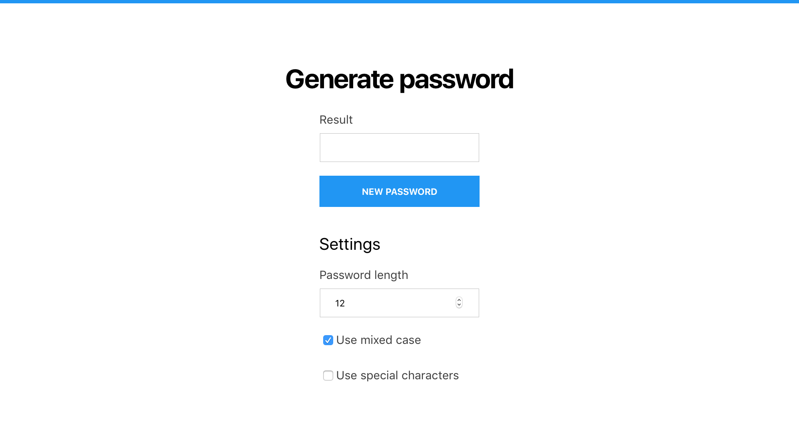

# Password generator

Let's create a `PassGenerator` component.

The user should be able to select:

- length of password to be generated
- whether or not to use mixed case (include both lowercase and upppercase letters)
- whether or not to use special characters

The default value for the password length should be 12.
By default use of mixed case is selected, but the use of special characters is not selected.

On form submit display the generated form in a field that cannot be edited.

